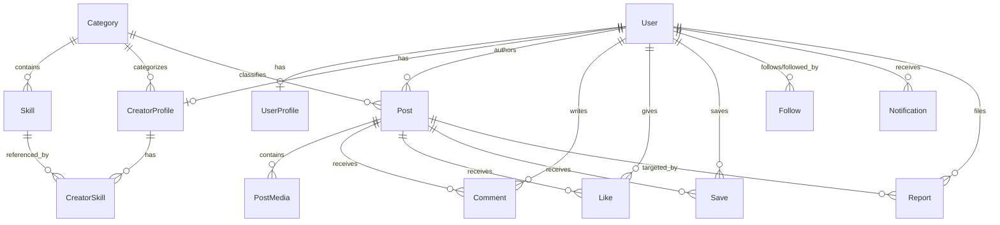

# ArtVest — System Architecture & Design Document
**PR1107 Major Project (4-Credit) • B.Tech Computer Science Engineering**

---

## 1. Executive Summary & Vision

**ArtVest** is a structured creative talent ecosystem where creative professionals (musicians, filmmakers, actors, dancers, photographers, designers, and production crew) showcase their genuine professional capabilities, discover collaborators through multi-attribute search, and build an audience.

### The Academic Problem
Existing social media platforms (Instagram, TikTok, YouTube) are designed for algorithmic passive consumption and viral trends, not professional creative discovery. Critical limitations of existing solutions include:
1. **Lack of Structured Metadata**: A filmmaker cannot search for *"Classical Singer in Jaipur available for indie film collaboration"*; search results on existing platforms are hashtag-reliant and unstructured.
2. **Homogeneous Profiles**: An actor, a sound engineer, and a choreographer all receive identical generic profile fields (bio + photo grid), ignoring role-specific requirements like vocal ranges, camera gear, acting lineages, or stage repertoires.
3. **High Gatekeeping**: Early-stage independent creators struggle to assemble multi-disciplinary crews without industry insider networks.

### The ArtVest Solution
ArtVest solves this through **Structured Creative Talent Discovery**, combining:
- Common identity and social graph foundations.
- Role-specific extensible metadata attributes (JSON-backed schema without database sprawl).
- Multi-criteria discovery service layer (Category, Skill, City, Experience, Availability).
- Phased academic architecture (Midterm Talent MVP $\rightarrow$ End-term Virtual Project Backing).

---

## 2. System Architecture Diagram

```
+-----------------------------------------------------------------------------------+
|                                 CLIENT TIER                                       |
|                                                                                   |
|  Next.js 16 App Router  |  React 19  |  Tailwind CSS  |  Framer Motion           |
|                                                                                   |
|  [ Landing Page ]    [ Explore / Discovery ]    [ Feed ]    [ Creator Studio ]    |
|  [ Login / Onboard ] [ Role Profiles ]          [ Saved ]   [ Notifications ]     |
+------------------------------------------+----------------------------------------+
                                           |
                                  HTTPS / REST JSON
                                  CORS & Cookies
                                           |
+------------------------------------------v----------------------------------------+
|                                APPLICATION TIER                                   |
|                                                                                   |
|  Node.js (v20+) & Express.js REST API with TypeScript                             |
|                                                                                   |
|  +-----------------------------------------------------------------------------+  |
|  | Middleware: Helmet, CORS, Morgan, Request Logging, Error Handler, RBAC      |  |
|  +-----------------------------------------------------------------------------+  |
|  | Controllers: HealthController, AuthController, CreatorController, etc.      |  |
|  +-----------------------------------------------------------------------------+  |
|  | Service Layer: Business logic, validation, metadata validation              |  |
|  +-----------------------------------------------------------------------------+  |
|  | Repository Layer: Data access isolation, query abstraction                   |  |
|  +-----------------------------------------------------------------------------+  |
|  | Prisma ORM (v6): Type-safe schema client, query engine, migrations          |  |
|  +-----------------------------------------------------------------------------+  |
+------------------------------------------+----------------------------------------+
                                           |
                              PostgreSQL Connection Pool
                                           |
+------------------------------------------v----------------------------------------+
|                                   DATA TIER                                       |
|                                                                                   |
|  PostgreSQL Relational Database                                                   |
|  - Relational Integrity (PK/FK Constraints, Cascade Policies)                     |
|  - Composite Unique Constraints (Prevention of duplicate Likes/Follows/Saves)     |
|  - B-Tree & GIN Indexes (Fast queries on city, experience, categories, skills)    |
+-----------------------------------------------------------------------------------+
```

---

## 3. Database Schema Architecture (Phase 1 Scope)

To balance relational rigor with role-specific flexibility, ArtVest employs a **Hybrid Relational-Document Pattern**:
- **Normalized Relational Entities** for core domain invariants: `User`, `Category`, `Skill`, `Post`, `PostMedia`, `Comment`, `Like`, `Save`, `Follow`, `Notification`, and `Report`.
- **Structured JSON Attributes** inside `CreatorProfile` (`roleAttributes`, `socialLinks`, `collaborationPreferences`) to prevent creating 30+ redundant database tables for every creative discipline.

### Entity Relationship Mapping



### Relational Schema Definitions
1. **User**: Authentication, role (`USER`, `CREATOR`, `ADMIN`), onboarding status.
2. **UserProfile**: General community attributes (username, bio, interests).
3. **CreatorProfile**: Primary category, stage name, city, country, experience level, availability, profile completion, verified status, and structured `roleAttributes`.
4. **Category**: Master creative categories (Music, Film & Acting, Dance, Photography & Video, Design & Digital Arts, Production & Support).
5. **Skill**: Distinct craft proficiencies mapped to categories (Singer, Cinematographer, Actor, 3D Artist, etc.).
6. **CreatorSkill**: Pivot entity connecting Creator to Skill with primary flag and years of experience.
7. **Post & PostMedia**: Polymorphic showcase post entity supporting Image, Video, Audio, Text, and Showcase cards with order indexes, durations, and aspect ratios.
8. **Comment, Like, Save, Follow**: Normalized social interactions with composite unique constraints (`[postId, userId]`, `[followerId, followingId]`) to prevent duplicate records.
9. **Notification & Report**: System alerts and content moderation audit trails.

---

## 4. Layered Backend Architecture

The Express application adheres to strict separation of concerns:
```
backend/src/
├── config/         # Environment variables & Prisma client singleton
├── controllers/    # HTTP request/response orchestrators
├── middleware/     # Error handling, route 404, security headers, RBAC
├── routes/         # Express router module declarations
├── services/       # Core business logic & validations
├── repositories/   # Data access abstraction
├── validators/     # Zod schema input validation
├── utils/          # Standard ApiResponse formatter, logger
├── types/          # Domain TypeScript type definitions
├── app.ts          # Express application factory
└── server.ts       # HTTP listener & graceful shutdown handlers
```

### API Design Principles
- Every response uses a consistent schema:
  ```json
  {
    "success": true,
    "message": "Human-readable status",
    "data": { ... },
    "timestamp": "2026-10-06T18:52:41.014Z"
  }
  ```
- Errors return standard codes (`NOT_FOUND`, `UNAUTHORIZED`, `VALIDATION_ERROR`, `INTERNAL_SERVER_ERROR`) without leaking stack traces in production environments.

---

## 5. Frontend Architecture & Design System

The Next.js 16 App Router application is modularized into feature boundaries:
```
frontend/src/
├── app/            # App Router pages and layouts
│   ├── app/        # Authenticated platform shell (Feed, Explore, Studio, Profile)
│   ├── login/      # Authentication & onboarding preview
│   └── page.tsx    # Cinematic landing page
├── components/     # Reusable layout and UI primitives
│   ├── layout/     # Navbar, AppSidebar, Footer
│   └── ui/         # PhaseBanner, Badge, Cards
├── features/       # Feature-oriented submodules
│   ├── auth/
│   ├── feed/
│   ├── profiles/
│   ├── posts/
│   ├── explore/
│   ├── notifications/
│   ├── dashboard/
│   └── projects/   # Reserved for Phase 2
├── services/       # Typed API client
└── types/          # Domain interfaces & Enums
```

### Aesthetic & UX Direction
- **Cinematic Obsidian Dark Theme**: Deep palette (`#090A10`, `#10131E`, `#1F2538`) with Amber Gold (`#F59E0B`) creative value accents.
- **Glassmorphism Primitives**: Backdrop blur panels with 1px translucent borders (`rgba(255, 255, 255, 0.08)`).
- **Subtle Category-Aware Theming**:
  - Music: Waveform Electric Pink (`#EC4899`)
  - Film: Cinematic Amber (`#F59E0B`)
  - Dance: Fluid Violet (`#8B5CF6`)
  - Photography: Aperture Cyan (`#06B6D4`)
  - Design: Emerald Green (`#10B981`)
  - Production: Studio Orange (`#F97316`)

---

## 6. Two-Phase Development Roadmap

| Phase | Milestone | Scope / Deliverables | Academic Target |
|---|---|---|---|
| **Phase 0** | Architecture Foundation | Project structure, TypeScript, Prisma Schema, Health API, Landing shell, App shell | Setup & Verification (Current) |
| **Phase 1** | Auth & Onboarding | Google OAuth, JWT tokens, Role selection, Creator onboarding | Midterm MVP Foundation |
| **Phase 2** | Creator Profiles & Skills | Profile editor, role-specific metadata forms, portfolio storage | Midterm MVP |
| **Phase 3** | Posts & Multimedia | Upload service (Cloudinary), Audio/Video/Image showcase posts | Midterm MVP |
| **Phase 4** | Feed & Social Graph | Chronological feed, Like, Comment, Save, Follow | Midterm MVP |
| **Phase 5** | Explore & Discovery | Multi-criteria search (Category, Role, City, Availability) | Midterm Release |
| **Phase 6** | Studio & Notifications | Creator studio metrics, notification alerts | Midterm Release |
| **Phase 7** | Midterm Stabilization | Testing, academic viva prep, demo data seeding | **MIDTERM VIVA MILESTONE** |
| **Phase 8-13**| Community Projects | Project teams, virtual credit wallet, community backing | **END-TERM VIVA MILESTONE** |
