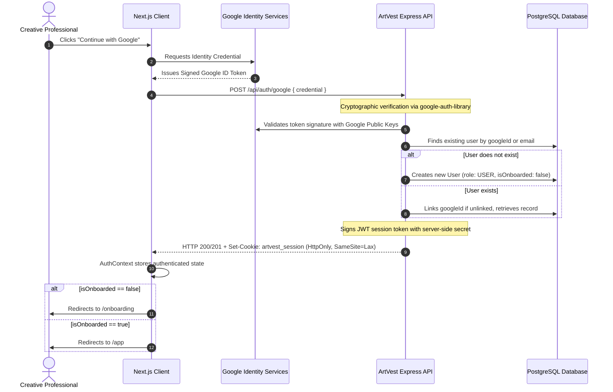
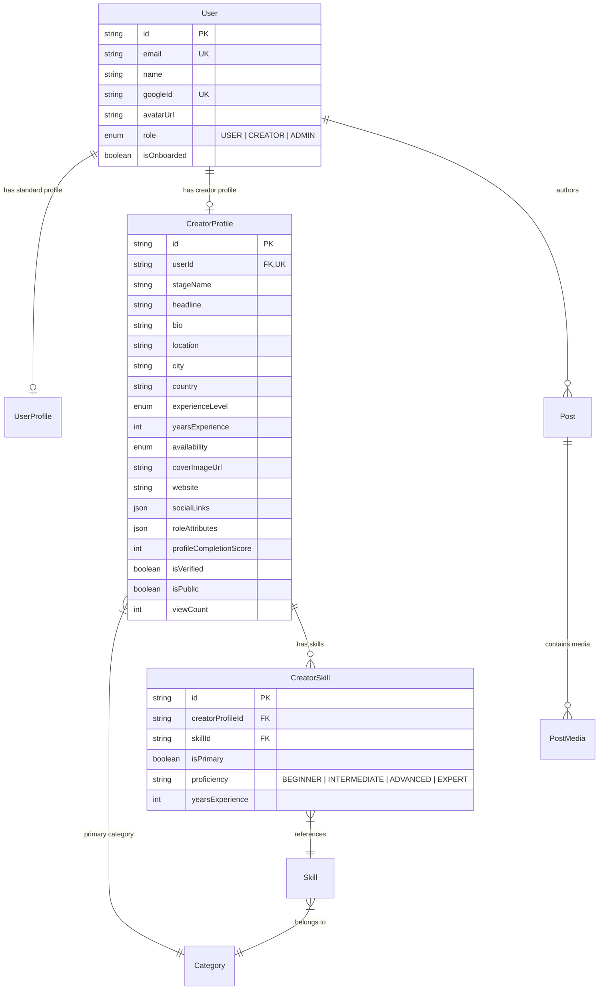

# ArtVest — System Architecture & Design Document
**PR1107 Major Project (4-Credit) • B.Tech Computer Science Engineering**

---

## 1. Executive Summary & Vision

**ArtVest** is a structured creative talent ecosystem where creative professionals (musicians, filmmakers, actors, dancers, photographers, designers, and production crew) showcase their genuine professional capabilities, discover collaborators through multi-attribute search, and build an audience.

### The Academic Problem
Existing social media platforms (Instagram, TikTok, YouTube) are designed for algorithmic passive consumption and viral trends, not professional creative discovery. Critical limitations of existing solutions include:
1. **Lack of Structured Metadata**: A filmmaker cannot search for *"Classical Singer in Mumbai available for indie film collaboration"*; search results on existing platforms are hashtag-reliant and unstructured.
2. **Homogeneous Profiles**: An actor, a sound engineer, and a choreographer all receive identical generic profile fields (bio + photo grid), ignoring role-specific requirements like vocal ranges, camera gear, acting lineages, or stage repertoires.
3. **High Gatekeeping**: Early-stage independent creators struggle to assemble multi-disciplinary crews without industry insider networks.

---

## 2. Authentication & Authorization Architecture

### 2.1 Google OAuth Identity Verification Flow
ArtVest implements a strict zero-trust identity verification flow:



### 2.2 Role-Based Access Control (RBAC)
Server-side middleware strictly enforces permissions on every request:
- `requireAuth`: Reads and verifies signed JWT from `HttpOnly` cookie or `Authorization: Bearer` header. Populates `req.user`.
- `requireRole(...roles)`: Blocks users lacking required role with HTTP 403 `FORBIDDEN`.
- `optionalAuth`: For public routes (e.g. `/api/creators/:creatorId`), populates `req.user` if valid session exists, permitting privacy checks while allowing public read access.

---

## 3. Creator Profile & Identity Architecture (Phase 2)



### 3.1 Relational Taxonomy & Dynamic Skills
1. **Taxonomy Separation**: Categories and Skills exist as independent entities in the database (`Category`, `Skill`). No skill names or category strings are hardcoded in the frontend.
2. **CreatorSkill Relation**: Links creators to skills with relational integrity.
   - Primary craft is flagged via `isPrimary: true`. When a new primary skill is set, previous primary skills are atomically unset in a transaction.
   - The primary skill is verified to match the creator's `primaryCategoryId`.
   - Secondary skills can span cross-disciplinary capabilities (e.g., a Classical Vocalist who is also an Ableton beat producer).
   - Duplicate relationships are blocked at both application and database level via `@@unique([creatorProfileId, skillId])`.

### 3.2 Role-Specific Metadata (`roleAttributes`)
Rather than creating separate tables for each profession, ArtVest employs a schema strategy:
- Core identity attributes (`location`, `experienceLevel`, `availability`, `bio`) are strongly typed database columns.
- Discipline-specific attributes are stored in a Postgres JSON column (`roleAttributes`) and validated with Zod schemas (`roleAttributes.validator.ts`) matching the creator's craft:
  - **Singers / Vocalists**: `genres`, `languages`, `vocalType`
  - **Musicians**: `instruments`, `genres`, `performanceExperience`
  - **Music Producers**: `genres`, `daws`, `productionSpecialties`
  - **Photographers**: `photographyTypes`, `equipment`, `editingTools`
  - **Videographers**: `videoStyles`, `cameraEquipment`, `editingTools`
  - **Actors**: `languages`, `actingStyles`, `theatreExperience`
  - **Directors**: `genres`, `projectTypes`, `directingExperience`
  - **Graphic Designers**: `designSpecialties`, `tools`, `industries`
  - **Animators / VFX**: `animationTypes`, `software`, `vfxSpecialties`
- Unstructured or malicious JSON injection is rejected with HTTP 400.

### 3.3 Profile Completion Algorithm
Profile strength is computed deterministically by the backend on a 100-point scale:
- **Artistic Alias (`stageName`)**: 10 pts
- **Headline Tagline**: 5 pts
- **Creative Bio ($\ge 20$ chars)**: 10 pts
- **Discipline Category**: 10 pts
- **Primary Craft Role**: 10 pts
- **Secondary Skills**: 10 pts
- **Location**: 10 pts
- **Experience Seniority**: 10 pts
- **Collaboration Availability**: 10 pts
- **Discipline Attributes**: 10 pts
- **Visual Cover Banner**: 5 pts

`GET /api/creator/profile/completion` returns the calculated score, current rank (`Emerging Talent`, `Active Creative`, `Established Creator`, `Master Portfolio`), and an explainable checklist with targeted recommendations.

---

## 4. Portfolio Foundation & Phase 3 Upload Architecture

### 4.1 Schema Foundation
The `Post` and `PostMedia` models provide the foundation for creative portfolio showcases:
- `Post.isFeatured`: Distinguishes portfolio showcase items from regular stream posts.
- `PostType`: Supports `IMAGE`, `VIDEO`, `AUDIO`, `TEXT`, `SHOWCASE`.
- `PostMedia.mediaType`: Supports `IMAGE`, `VIDEO`, `AUDIO`, `DOCUMENT`.
- `PostMedia.meta`: JSON storage for audio waveforms, resolution dimensions, and codecs.

### 4.2 Phase 3 Media Upload Architecture
```
Client Browser (File Input)
       │
       │  Multipart upload with HttpOnly session cookie
       ▼
ArtVest API (/api/media/upload)
       │
       │  Signed upload stream with secret provider credentials
       ▼
Media Storage Provider (Cloudinary / AWS S3)
       │
       │  Returns secure CDN URL, format metadata, waveform
       ▼
ArtVest PostgreSQL DB (Stored in Post / PostMedia)
```
Provider API secrets remain quarantined on the backend and are never sent to the browser.

---

## 5. System Tier Architecture

```
+-----------------------------------------------------------------------------------+
|                                 CLIENT TIER                                       |
|                                                                                   |
|  Next.js 16 App Router  |  React 19  |  Tailwind CSS v4  |  Framer Motion         |
|                                                                                   |
|  [ Landing Page ]      [ Login / GIS ]         [ Onboarding (5-Step) ]             |
|  [ Creator Profile ]   [ Public /creator/:id ] [ Skills Manager Modal ]            |
|  [ Edit Profile Modal ][ Profile Strength Card][ Portfolio Foundation ]            |
+------------------------------------------+----------------------------------------+
                                           |
                                  HTTPS / REST JSON
                             HttpOnly Cookie Credentials
                                           |
+------------------------------------------v----------------------------------------+
|                                APPLICATION TIER                                   |
|                                                                                   |
|  Node.js (v20+) & Express.js REST API with TypeScript                             |
|                                                                                   |
|  +-----------------------------------------------------------------------------+  |
|  | Middleware: Cookie-Parser, Helmet, CORS, Morgan, requireAuth, requireRole   |  |
|  +-----------------------------------------------------------------------------+  |
|  | Controllers: AuthController, OnboardingController, CreatorController,       |  |
|  |              UserController, TaxonomyController                             |  |
|  +-----------------------------------------------------------------------------+  |
|  | Services: AuthService, OnboardingService, CreatorService, UserService      |  |
|  +-----------------------------------------------------------------------------+  |
|  | Validators: roleAttributes.validator, creator.validator, user.validator     |  |
|  +-----------------------------------------------------------------------------+  |
|  | Algorithm: profileCompletion.ts (Deterministic 100-pt explainable scoring)  |  |
|  +-----------------------------------------------------------------------------+  |
|  | Prisma ORM (v6): Type-safe schema client, connection pool, migrations       |  |
|  +-----------------------------------------------------------------------------+  |
+------------------------------------------+----------------------------------------+
                                           |
                              PostgreSQL Connection Pool
                                           |
+------------------------------------------v----------------------------------------+
|                                   DATA TIER                                       |
|                                                                                   |
|  PostgreSQL Relational Database                                                   |
|  - Users & Profiles: User, UserProfile, CreatorProfile                            |
|  - Taxonomy: Category, Skill, CreatorSkill                                        |
|  - Portfolio Foundation: Post, PostMedia                                          |
|  - Composite Unique Constraints: @@unique([creatorProfileId, skillId])          |
|  - Indexing: B-Tree on emails, googleId, roles, locations, categories, isPublic   |
+-----------------------------------------------------------------------------------+
```

---

---

## 6. Phase 3 Architecture: Multimedia Showcase & Content Engine

### 6.1 Content Processing & Retrieval Dataflow
```
Browser
   ↓ Next.js (App Router, Turbopack)
Next.js Client Components (PostCard, MediaGallery, AudioPreview, VideoPreview)
   ↓ Fetch API with credentials: 'include' (HttpOnly Cookie)
Express REST API Service (Node.js 20, TypeScript, Port 5000)
   ↓ auth.middleware (derive req.user.id, requireRole CREATOR)
Post Service (post.service.ts) & Validators (post.validator.ts)
   ↓ Type-safe Prisma Client (v6)
PostgreSQL Database (Tables: Post, PostMedia, CreatorProfile, Skill)
```

### 6.2 Secure Provider-Agnostic Media Upload Flow
```
Browser (Upload File)
   ↓ POST /api/media/upload (with multipart buffer)
Express Media Controller & Multer (In-Memory Buffer)
   ↓ MediaStorageService.validateMediaFile (MIME type check + byte size limits)
Cloudinary Media CDN (or Local Disk Fallback in dev/tests)
   ↓ Secure upload with poster generation & waveform metadata
Cloudinary CDN URL + Dimensions + Waveform Array
   ↓ MediaStorageService.uploadMedia
PostMedia Record created in PostgreSQL via Prisma
   ↓ Linked to author's Post (orderIndex, aspectRatio, meta)
Post Published to Showcase Feed & Portfolio
```

### 6.3 Post Lifecycle State Machine
```
                       +-----------------------+
                       |        DRAFT          |
                       |  (Author Studio Only) |
                       +-----------------------+
                                   |
                validatePostForPublishing (completeness check)
                                   |
                                   v
                       +-----------------------+
                       |       PUBLISHED       |
                       |  (Feed & Portfolio)   |
                       +-----------------------+
                                   |
                                   v
                       +-----------------------+
                       |       ARCHIVED        |
                       | (Hidden from Public)  |
                       +-----------------------+
```

---

## 7. Phase 4 Architecture: Social Graph & Creative Interaction

### 7.1 Conceptual Architecture
The Social Graph links users, published creative showcases, and creators through relational interactions and structured collaboration expressions:

```
User
 │
 ├── Like ──────────→ Post (unique [postId, userId])
 │
 ├── Save ──────────→ Post (unique [postId, userId])
 │
 ├── Comment ───────→ Post (with self-referencing parentId for nested replies)
 │
 ├── Follow ────────→ Creator / User (unique [followerId, followingId], prevents self-follow)
 │
 └── CollaborationInquiry
          │
          ├── sender (User)
          ├── recipient (User)
          └── referenced Post (Post?, optional inspiration)
```

### 7.2 Database Entities & Relational Schema
Extended in Prisma schema (`schema.prisma`):

1. **Like**:
   - `id`: `String @id @default(cuid())`
   - `postId`: `String` (foreign key to `Post`, cascades on delete)
   - `userId`: `String` (foreign key to `User`, cascades on delete)
   - `createdAt`: `DateTime @default(now())`
   - Constraints: `@@unique([postId, userId])`, `@@index([postId])`, `@@index([userId])`.
   - Guaranteed uniqueness enforced at PostgreSQL engine level.

2. **Save (Bookmarks)**:
   - `id`: `String @id @default(cuid())`
   - `postId`: `String` (foreign key to `Post`, cascades on delete)
   - `userId`: `String` (foreign key to `User`, cascades on delete)
   - `createdAt`: `DateTime @default(now())`
   - Constraints: `@@unique([postId, userId])`, `@@index([postId])`, `@@index([userId])`.

3. **Comment**:
   - `id`: `String @id @default(cuid())`
   - `postId`: `String` (foreign key to `Post`, cascades on delete)
   - `authorId`: `String` (foreign key to `User`, cascades on delete)
   - `content`: `String` (1 to 2,000 characters, trimmed, required)
   - `parentId`: `String?` (self-referencing foreign key to `Comment`, allows 1-level nested replies)
   - `createdAt`, `updatedAt`: Timestamps
   - Constraints: `@@index([postId])`, `@@index([authorId])`, `@@index([parentId])`.

4. **Follow**:
   - `id`: `String @id @default(cuid())`
   - `followerId`: `String` (foreign key to `User`, cascades on delete)
   - `followingId`: `String` (foreign key to `User`, cascades on delete)
   - `createdAt`: `DateTime @default(now())`
   - Constraints: `@@unique([followerId, followingId])`, `@@index([followerId])`, `@@index([followingId])`.
   - Server-side rule: User cannot follow themselves (`followerId !== followingId`).

5. **CollaborationInquiry**:
   - `id`: `String @id @default(cuid())`
   - `senderId`: `String` (foreign key to `User`, cascades on delete)
   - `recipientId`: `String` (foreign key to `User`, cascades on delete)
   - `postId`: `String?` (foreign key to `Post`, sets null on post delete)
   - `message`: `String` (10 to 2,000 characters, trimmed)
   - `status`: `InquiryStatus` enum (`PENDING`, `ACCEPTED`, `DECLINED`, `WITHDRAWN`)
   - `createdAt`, `updatedAt`: Timestamps
   - Constraints: `@@index([senderId])`, `@@index([recipientId])`, `@@index([postId])`.

### 7.3 Post Interaction Boundary Rules
Only `PUBLISHED` posts can be interacted with:
- Likes, Saves, and Comments on `DRAFT`, `ARCHIVED`, or non-existent posts fail with HTTP 400 `CANNOT_INTERACT_WITH_UNPUBLISHED_POST`.
- Collaboration Inquiries referencing unpublished posts fail with HTTP 400.
- All rules are enforced strictly server-side by checking `post.status === PostStatus.PUBLISHED`.

### 7.4 Collaboration Inquiry Lifecycle State Machine
```
                           [ User sends Inquiry ]
                                     │
                                     ▼
                            +-----------------+
                            |     PENDING     |
                            +-----------------+
                              /      |      \
        Sender Withdraws     /       |       \   Recipient Declines
                            /        |        \
                           v         |         v
                   +-----------+     |    +----------+
                   | WITHDRAWN |     |    | DECLINED |
                   +-----------+     |    +----------+
                                     |
                             Recipient Accepts
                                     |
                                     v
                              +------------+
                              |  ACCEPTED  |
                              +------------+
```

Strict authorization enforcement:
- **Sender can**: Create inquiry, view sent inquiries (`GET /api/collaboration/inquiries/sent`), withdraw their own pending inquiry (`PATCH ... { status: WITHDRAWN }`).
- **Sender cannot**: Accept or decline their own inquiry (HTTP 403 `FORBIDDEN_INQUIRY_ACTION`).
- **Recipient can**: View received inquiries (`GET /api/collaboration/inquiries/received`), accept (`PATCH ... { status: ACCEPTED }`), decline (`PATCH ... { status: DECLINED }`).
- **Recipient cannot**: Withdraw on behalf of sender or modify inquiry message.
- **Third parties cannot**: View or mutate inquiries between other users.
- **Terminal states**: Once `ACCEPTED`, `DECLINED`, or `WITHDRAWN`, status cannot be transitioned again (HTTP 400 `INVALID_INQUIRY_STATE`).

### 7.5 Phase 4 REST API Surface

| Method | Endpoint | Authorization | Description |
|---|---|---|---|
| `POST` | `/api/posts/:postId/like` | Authenticated | Likes a published post (idempotent; returns `{ liked: true, count }`) |
| `DELETE` | `/api/posts/:postId/like` | Authenticated | Unlikes a post (returns `{ liked: false, count }`) |
| `GET` | `/api/posts/:postId/likes` | Public / Optional Auth | Returns appreciation count and whether current viewer liked the post |
| `POST` | `/api/posts/:postId/save` | Authenticated | Bookmarks a published post (idempotent; returns `{ saved: true, count }`) |
| `DELETE` | `/api/posts/:postId/save` | Authenticated | Removes post from user's saved collection |
| `GET` | `/api/user/saved` | Authenticated | Paginated list of user's saved showcases with full post and creator details |
| `POST` | `/api/posts/:postId/comments` | Authenticated | Adds comment or reply (supports `parentId` for nesting; max 2,000 chars) |
| `GET` | `/api/posts/:postId/comments` | Public | Returns top-level comments with nested replies and total count |
| `PATCH` | `/api/comments/:commentId` | Authenticated (Author) | Updates comment content; strictly rejects unauthorized users (403) |
| `DELETE` | `/api/comments/:commentId` | Authenticated (Author/Admin) | Deletes comment and cascaded replies |
| `POST` | `/api/creators/:creatorId/follow` | Authenticated | Follows creator (accepts `userId` or `creatorProfileId`; prevents self-follow) |
| `DELETE` | `/api/creators/:creatorId/follow` | Authenticated | Unfollows creator |
| `GET` | `/api/user/followers` | Authenticated | Paginated list of followers |
| `GET` | `/api/user/following` | Authenticated | Paginated list of creators the user follows |
| `POST` | `/api/collaboration/inquiries` | Authenticated | Sends structured collaboration inquiry to creator with optional post link |
| `GET` | `/api/collaboration/inquiries/sent` | Authenticated | Retrieves sent inquiries with recipient details, referenced post, and status |
| `GET` | `/api/collaboration/inquiries/received` | Authenticated | Retrieves received inquiries with sender details and action buttons |
| `PATCH` | `/api/collaboration/inquiries/:id` | Authenticated (Participant) | Updates status (`ACCEPTED`/`DECLINED` by recipient, `WITHDRAWN` by sender) |

### 7.6 N+1 Query Prevention & Performance
In `PostService.getShowcaseFeed`, `getPostById`, `getPublicCreatorPosts`, and `getCreatorPosts`:
- Relational aggregation `_count: { select: { likes: true, comments: true, saves: true } }` runs in the initial database query.
- When viewer is authenticated, conditional relation selection:
  - `likes: { where: { userId }, select: { id: true } }`
  - `saves: { where: { userId }, select: { id: true } }`
  - `author.followers: { where: { followerId: userId }, select: { id: true } }`
- Resolves all interaction state (`likeCount`, `commentCount`, `saveCount`, `likedByMe`, `savedByMe`, `followingCreator`) in a single query with zero separate N+1 roundtrips.

### 7.7 Future Notification Hooks (Phase 6 Integration Points)
The interaction service is structured around distinct domain events that Phase 6 will consume to dispatch asynchronous notification alerts:
- `EVENT_POST_LIKED`: Dispatched when `likePost` succeeds (actor: liker, recipient: post author).
- `EVENT_COMMENT_CREATED`: Dispatched when `createComment` succeeds (recipient: post author or parent comment author).
- `EVENT_CREATOR_FOLLOWED`: Dispatched when `followCreator` succeeds (recipient: followed creator).
- `EVENT_INQUIRY_CREATED`: Dispatched when `createInquiry` succeeds (recipient: creator).
- `EVENT_INQUIRY_STATUS_CHANGED`: Dispatched when inquiry is accepted/declined (recipient: sender).

---

## 8. Phase 5 Architecture: Explore & Structured Discovery

### 8.1 The Academic Differentiator: Structured Talent Discovery vs Algorithmic Consumption
Traditional social platforms treat creators as uniform accounts with generic bios, forcing discovery through viral engagement algorithms and hashtag hacks. ArtVest implements a **relational, multi-attribute indexing and deterministic discovery engine** designed specifically for professional creative talent:

```
User Query / Filter Criteria
       │
       ▼
Prisma Multi-Attribute Filter Pipeline (PostgreSQL Composite Indexes)
 ├── Category Filter        (Music, Film, Dance, Photography, Design, Production)
 ├── Skill / Role Filter    (Singer, Cinematographer, 3D Artist, Sound Engineer...)
 ├── Location Match         (City, State, Country case-insensitive substring)
 ├── Experience Tier        (BEGINNER, INTERMEDIATE, ADVANCED, PROFESSIONAL, VETERAN)
 ├── Availability Status    (AVAILABLE_FOR_COLLAB, OPEN_TO_WORK, FREELANCE, COMMISSION)
 ├── Skill Proficiency      (BEGINNER, INTERMEDIATE, ADVANCED, EXPERT)
 └── Multi-Token Keyword    ("Classical Singer in Jaipur" -> [Classical, Singer, Jaipur])
       │
       ▼
Candidate Candidate Retrieval (STRICT: isPublic = true, status = PUBLISHED)
       │
       ▼
Deterministic Relevance Scoring Engine (Zero Black-Box ML / No LLMs)
       │
       ▼
Ranked Creators & Showcases + Explainable Score Breakdown
```

### 8.2 Deterministic Relevance Scoring Formula
ArtVest strictly avoids opaque machine learning or unexplainable recommendation models. Instead, ranking is calculated using a **transparent, deterministic, explainable point formula**:

$$\text{Relevance Score} = S_{\text{keyword}} + S_{\text{category}} + S_{\text{skill}} + S_{\text{location}} + S_{\text{experience}} + S_{\text{availability}} + S_{\text{quality}} + S_{\text{depth}}$$

| Component | Max Points | Evaluation Logic |
|---|---|---|
| **$S_{\text{keyword}}$ (Keyword Match)** | 40 pts | +30 for exact name/stageName match, +20 for partial match, +15 for headline match, +12 for location match, +10 for skill name token hits, +6 for bio match. |
| **$S_{\text{category}}$ (Category Match)** | 20 pts | +20 if creator's primary category matches requested category filter or keyword. |
| **$S_{\text{skill}}$ (Skill / Role Match)** | 25 pts | +25 if creator possesses requested skill as their **Primary Skill** (`isPrimary: true`); +15 if secondary skill. |
| **$S_{\text{location}}$ (Location Match)** | 15 pts | +15 if creator's stored city or location matches location filter or keyword. |
| **$S_{\text{experience}}$ (Experience Match)** | 10 pts | +10 if creator matches requested experience tier (`PROFESSIONAL`, `ADVANCED`, etc.). |
| **$S_{\text{availability}}$ (Availability Match)** | 10 pts | +10 for matching explicit availability filter; +6 passive boost for active collaboration readiness (`AVAILABLE_FOR_COLLAB`). |
| **$S_{\text{quality}}$ (Profile Quality)** | 15 pts | $\min(15, \lfloor\text{profileCompletionScore} \times 0.1\rfloor + (\text{isVerified} \times 5))$. |
| **$S_{\text{depth}}$ (Portfolio Depth)** | 10 pts | $\min(10, \text{publishedShowcasesCount} \times 2)$. |

**Stable Tie-Breaking**: When two candidates have identical relevance scores, ordering deterministically falls back to `profileCompletionScore DESC`, then `createdAt DESC`, with unique `id ASC` as the final deterministic tie-breaker.

### 8.3 REST API Surface (Explore & Discovery)

| Method | Endpoint | Authorization | Description |
|---|---|---|---|
| `GET` | `/api/explore` | Public / Optional Auth | Overview combining top creators, featured showcases, and active category taxonomy |
| `GET` | `/api/explore/creators` | Public / Optional Auth | Multi-attribute creator search with deterministic ranking and explainable score breakdowns |
| `GET` | `/api/explore/posts` | Public / Optional Auth | Published creative showcase discovery by category, skill, postType, and tags |

### 8.4 Database Indexing Decisions
To guarantee sub-10ms response times across large talent catalogs, composite indexes were applied via migration `20261007085649_explore_discovery_phase5`:
- `CreatorProfile`: `@@index([isPublic, primaryCategoryId])` — speeds up discipline-scoped public queries.
- `CreatorProfile`: `@@index([isPublic, profileCompletionScore])` — optimizes profile strength sort order.
- `CreatorProfile`: `@@index([isPublic, createdAt])` — accelerates newest creator discovery.
- `Post`: `@@index([status, categoryId])` — guarantees fast published showcase category filtering.
- `Post`: `@@index([status, publishedAt])` — accelerates chronological feed and popular showcase exploration.

### 8.5 URL-Driven Client Architecture
The frontend Explore experience (`/app/explore` and `/explore`) mirrors all query and filter state directly into URL Search Parameters:
- `?tab=creators&q=Classical+Singer&location=Jaipur&experience=PROFESSIONAL&sort=relevance&page=1`
- Preserves full browser history (back/forward navigation), allows bookmarking and sharing of custom discovery queries, and survives page refreshes without losing state.

---

## 9. Milestone Progress & Roadmap

| Phase | Milestone | Scope / Deliverables | Status |
|---|---|---|---|
| **Phase 0** | Architecture Foundation | Monorepo structure, TypeScript, Prisma Schema, Health API, Landing shell | **COMPLETED** |
| **Phase 1** | Auth & Onboarding | Google OAuth verification, HttpOnly sessions, RBAC, Onboarding UI, Taxonomy API, Tests (13/13) | **COMPLETED** |
| **Phase 2** | Creator Identity & Skills | Profile editor, dynamic skills management, proficiencies, role metadata validation, completion scoring, public creator discovery, portfolio foundation, Tests (27/27) | **COMPLETED** |
| **Phase 3** | Posts & Multimedia | Multimedia content engine (IMAGE, VIDEO, AUDIO, TEXT, SHOWCASE), Cloudinary upload abstraction, Creator Studio (`/app/studio`), live chronological feed (`/app`), waveform audio player, 5-step showcase creator flow, Tests (43/43) | **COMPLETED** |
| **Phase 4** | Social Graph & Interaction | Relational social graph: Post appreciation likes, Saved showcases/bookmarks, Nested comment discussions & replies, Creator follow graph, Structured collaboration inquiries & workflow, Studio inquiries management, Tests (83/83) | **COMPLETED** |
| **Phase 5** | Explore & Structured Discovery | Multi-attribute structured discovery (Category, Skill, Location, Experience, Availability, Proficiency), multi-token keyword search ("Classical Singer in Jaipur"), explainable deterministic relevance ranking, URL state sync, responsive sidebar/drawer, Tests (108/108) | **COMPLETED** |
| **Phase 6** | Studio & Notifications | Creator studio analytics, event-driven notification alerts | Upcoming |
| **Phase 7** | Midterm Stabilization | End-to-end integration, academic viva prep, demo data seeding | **MIDTERM VIVA** |
| **Phase 8** | Creative Projects | Project creation, creative briefs, role definitions, milestone tracking | Upcoming |
| **Phase 9** | Multidisciplinary Teams | Team invitations, role fulfillment, collaborative project workspace | Upcoming |
| **Phase 10** | ArtCredits | Simulated virtual credit wallet, milestone allocations, non-cash economy | Upcoming |
| **Phase 11** | Community Backing | Project crowdfunding, community micro-backing, reward tiers | Upcoming |
| **Phase 12** | Analytics & Recommendations | Platform analytics, discovery heuristics, engagement insights | Upcoming |
| **Phase 13** | Final Polish & Viva Defense | Performance tuning, security audit, deployment, comprehensive thesis documentation | **END-TERM VIVA** |


