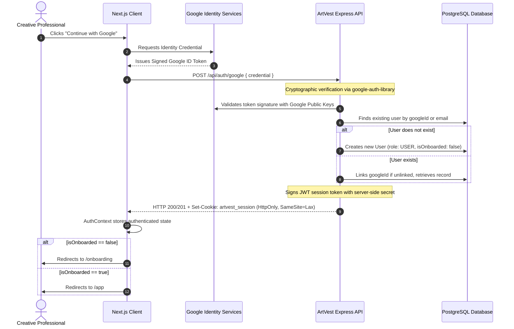
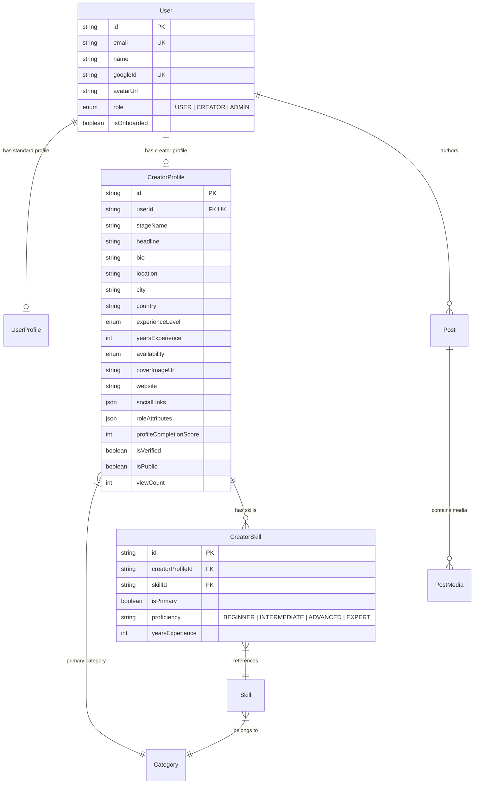

# ArtVest — System Architecture & Design Document
**PR1107 Major Project (4-Credit) • B.Tech Computer Science Engineering**

---

## 1. Executive Summary & Vision

**ArtVest** is a structured creative talent ecosystem where creative professionals (musicians, filmmakers, actors, dancers, photographers, designers, and production crew) showcase their genuine professional capabilities, discover collaborators through multi-attribute search, and build an audience.

### The Academic Problem
Existing social media platforms (Instagram, TikTok, YouTube) are designed for algorithmic passive consumption and viral trends, not professional creative discovery. Critical limitations of existing solutions include:
1. **Lack of Structured Metadata**: A filmmaker cannot search for *"Classical Singer in Mumbai available for indie film collaboration"*; search results on existing platforms are hashtag-reliant and unstructured.
2. **Homogeneous Profiles**: An actor, a sound engineer, and a choreographer all receive identical generic profile fields (bio + photo grid), ignoring role-specific requirements like vocal ranges, camera gear, acting lineages, or stage repertoires.
3. **High Gatekeeping**: Early-stage independent creators struggle to assemble multi-disciplinary crews without industry insider networks.

---

## 2. Authentication & Authorization Architecture

### 2.1 Google OAuth Identity Verification Flow
ArtVest implements a strict zero-trust identity verification flow:



### 2.2 Role-Based Access Control (RBAC)
Server-side middleware strictly enforces permissions on every request:
- `requireAuth`: Reads and verifies signed JWT from `HttpOnly` cookie or `Authorization: Bearer` header. Populates `req.user`.
- `requireRole(...roles)`: Blocks users lacking required role with HTTP 403 `FORBIDDEN`.
- `optionalAuth`: For public routes (e.g. `/api/creators/:creatorId`), populates `req.user` if valid session exists, permitting privacy checks while allowing public read access.

---

## 3. Creator Profile & Identity Architecture (Phase 2)



### 3.1 Relational Taxonomy & Dynamic Skills
1. **Taxonomy Separation**: Categories and Skills exist as independent entities in the database (`Category`, `Skill`). No skill names or category strings are hardcoded in the frontend.
2. **CreatorSkill Relation**: Links creators to skills with relational integrity.
   - Primary craft is flagged via `isPrimary: true`. When a new primary skill is set, previous primary skills are atomically unset in a transaction.
   - The primary skill is verified to match the creator's `primaryCategoryId`.
   - Secondary skills can span cross-disciplinary capabilities (e.g., a Classical Vocalist who is also an Ableton beat producer).
   - Duplicate relationships are blocked at both application and database level via `@@unique([creatorProfileId, skillId])`.

### 3.2 Role-Specific Metadata (`roleAttributes`)
Rather than creating separate tables for each profession, ArtVest employs a schema strategy:
- Core identity attributes (`location`, `experienceLevel`, `availability`, `bio`) are strongly typed database columns.
- Discipline-specific attributes are stored in a Postgres JSON column (`roleAttributes`) and validated with Zod schemas (`roleAttributes.validator.ts`) matching the creator's craft:
  - **Singers / Vocalists**: `genres`, `languages`, `vocalType`
  - **Musicians**: `instruments`, `genres`, `performanceExperience`
  - **Music Producers**: `genres`, `daws`, `productionSpecialties`
  - **Photographers**: `photographyTypes`, `equipment`, `editingTools`
  - **Videographers**: `videoStyles`, `cameraEquipment`, `editingTools`
  - **Actors**: `languages`, `actingStyles`, `theatreExperience`
  - **Directors**: `genres`, `projectTypes`, `directingExperience`
  - **Graphic Designers**: `designSpecialties`, `tools`, `industries`
  - **Animators / VFX**: `animationTypes`, `software`, `vfxSpecialties`
- Unstructured or malicious JSON injection is rejected with HTTP 400.

### 3.3 Profile Completion Algorithm
Profile strength is computed deterministically by the backend on a 100-point scale:
- **Artistic Alias (`stageName`)**: 10 pts
- **Headline Tagline**: 5 pts
- **Creative Bio ($\ge 20$ chars)**: 10 pts
- **Discipline Category**: 10 pts
- **Primary Craft Role**: 10 pts
- **Secondary Skills**: 10 pts
- **Location**: 10 pts
- **Experience Seniority**: 10 pts
- **Collaboration Availability**: 10 pts
- **Discipline Attributes**: 10 pts
- **Visual Cover Banner**: 5 pts

`GET /api/creator/profile/completion` returns the calculated score, current rank (`Emerging Talent`, `Active Creative`, `Established Creator`, `Master Portfolio`), and an explainable checklist with targeted recommendations.

---

## 4. Portfolio Foundation & Phase 3 Upload Architecture

### 4.1 Schema Foundation
The `Post` and `PostMedia` models provide the foundation for creative portfolio showcases:
- `Post.isFeatured`: Distinguishes portfolio showcase items from regular stream posts.
- `PostType`: Supports `IMAGE`, `VIDEO`, `AUDIO`, `TEXT`, `SHOWCASE`.
- `PostMedia.mediaType`: Supports `IMAGE`, `VIDEO`, `AUDIO`, `DOCUMENT`.
- `PostMedia.meta`: JSON storage for audio waveforms, resolution dimensions, and codecs.

### 4.2 Phase 3 Media Upload Architecture
```
Client Browser (File Input)
       │
       │  Multipart upload with HttpOnly session cookie
       ▼
ArtVest API (/api/media/upload)
       │
       │  Signed upload stream with secret provider credentials
       ▼
Media Storage Provider (Cloudinary / AWS S3)
       │
       │  Returns secure CDN URL, format metadata, waveform
       ▼
ArtVest PostgreSQL DB (Stored in Post / PostMedia)
```
Provider API secrets remain quarantined on the backend and are never sent to the browser.

---

## 5. System Tier Architecture

```
+-----------------------------------------------------------------------------------+
|                                 CLIENT TIER                                       |
|                                                                                   |
|  Next.js 16 App Router  |  React 19  |  Tailwind CSS v4  |  Framer Motion         |
|                                                                                   |
|  [ Landing Page ]      [ Login / GIS ]         [ Onboarding (5-Step) ]             |
|  [ Creator Profile ]   [ Public /creator/:id ] [ Skills Manager Modal ]            |
|  [ Edit Profile Modal ][ Profile Strength Card][ Portfolio Foundation ]            |
+------------------------------------------+----------------------------------------+
                                           |
                                  HTTPS / REST JSON
                             HttpOnly Cookie Credentials
                                           |
+------------------------------------------v----------------------------------------+
|                                APPLICATION TIER                                   |
|                                                                                   |
|  Node.js (v20+) & Express.js REST API with TypeScript                             |
|                                                                                   |
|  +-----------------------------------------------------------------------------+  |
|  | Middleware: Cookie-Parser, Helmet, CORS, Morgan, requireAuth, requireRole   |  |
|  +-----------------------------------------------------------------------------+  |
|  | Controllers: AuthController, OnboardingController, CreatorController,       |  |
|  |              UserController, TaxonomyController                             |  |
|  +-----------------------------------------------------------------------------+  |
|  | Services: AuthService, OnboardingService, CreatorService, UserService      |  |
|  +-----------------------------------------------------------------------------+  |
|  | Validators: roleAttributes.validator, creator.validator, user.validator     |  |
|  +-----------------------------------------------------------------------------+  |
|  | Algorithm: profileCompletion.ts (Deterministic 100-pt explainable scoring)  |  |
|  +-----------------------------------------------------------------------------+  |
|  | Prisma ORM (v6): Type-safe schema client, connection pool, migrations       |  |
|  +-----------------------------------------------------------------------------+  |
+------------------------------------------+----------------------------------------+
                                           |
                              PostgreSQL Connection Pool
                                           |
+------------------------------------------v----------------------------------------+
|                                   DATA TIER                                       |
|                                                                                   |
|  PostgreSQL Relational Database                                                   |
|  - Users & Profiles: User, UserProfile, CreatorProfile                            |
|  - Taxonomy: Category, Skill, CreatorSkill                                        |
|  - Portfolio Foundation: Post, PostMedia                                          |
|  - Composite Unique Constraints: @@unique([creatorProfileId, skillId])          |
|  - Indexing: B-Tree on emails, googleId, roles, locations, categories, isPublic   |
+-----------------------------------------------------------------------------------+
```

---

---

## 6. Phase 3 Architecture: Multimedia Showcase & Content Engine

### 6.1 Content Processing & Retrieval Dataflow
```
Browser
   ↓ Next.js (App Router, Turbopack)
Next.js Client Components (PostCard, MediaGallery, AudioPreview, VideoPreview)
   ↓ Fetch API with credentials: 'include' (HttpOnly Cookie)
Express REST API Service (Node.js 20, TypeScript, Port 5000)
   ↓ auth.middleware (derive req.user.id, requireRole CREATOR)
Post Service (post.service.ts) & Validators (post.validator.ts)
   ↓ Type-safe Prisma Client (v6)
PostgreSQL Database (Tables: Post, PostMedia, CreatorProfile, Skill)
```

### 6.2 Secure Provider-Agnostic Media Upload Flow
```
Browser (Upload File)
   ↓ POST /api/media/upload (with multipart buffer)
Express Media Controller & Multer (In-Memory Buffer)
   ↓ MediaStorageService.validateMediaFile (MIME type check + byte size limits)
Cloudinary Media CDN (or Local Disk Fallback in dev/tests)
   ↓ Secure upload with poster generation & waveform metadata
Cloudinary CDN URL + Dimensions + Waveform Array
   ↓ MediaStorageService.uploadMedia
PostMedia Record created in PostgreSQL via Prisma
   ↓ Linked to author's Post (orderIndex, aspectRatio, meta)
Post Published to Showcase Feed & Portfolio
```

### 6.3 Post Lifecycle State Machine
```
                       +-----------------------+
                       |        DRAFT          |
                       |  (Author Studio Only) |
                       +-----------------------+
                                   |
                validatePostForPublishing (completeness check)
                                   |
                                   v
                       +-----------------------+
                       |       PUBLISHED       |
                       |  (Feed & Portfolio)   |
                       +-----------------------+
                                   |
                                   v
                       +-----------------------+
                       |       ARCHIVED        |
                       | (Hidden from Public)  |
                       +-----------------------+
```

---

## 7. Milestone Progress & Roadmap

| Phase | Milestone | Scope / Deliverables | Status |
|---|---|---|---|
| **Phase 0** | Architecture Foundation | Monorepo structure, TypeScript, Prisma Schema, Health API, Landing shell | **COMPLETED** |
| **Phase 1** | Auth & Onboarding | Google OAuth verification, HttpOnly sessions, RBAC, Onboarding UI, Taxonomy API, Tests (13/13) | **COMPLETED** |
| **Phase 2** | Creator Identity & Skills | Profile editor, dynamic skills management, proficiencies, role metadata validation, completion scoring, public creator discovery, portfolio foundation, Tests (27/27) | **COMPLETED** |
| **Phase 3** | Posts & Multimedia | Multimedia content engine (IMAGE, VIDEO, AUDIO, TEXT, SHOWCASE), Cloudinary upload abstraction, Creator Studio (`/app/studio`), live chronological feed (`/app`), waveform audio player, 5-step showcase creator flow, Tests (43/43) | **COMPLETED** |
| **Phase 4** | Social Graph & Backing | Chronological feed social interactions: Likes, Comments, Saves, Follows, Collaborator Inquiries | Upcoming |
| **Phase 5** | Explore & Discovery | Multi-criteria structured discovery (Category, Role, City, Availability) | Upcoming |
| **Phase 6** | Studio & Notifications | Creator studio metrics, notification alerts | Upcoming |
| **Phase 7** | Midterm Stabilization | End-to-end integration, academic viva prep, demo data seeding | **MIDTERM VIVA** |
| **Phase 8-13**| Community Projects | Multidisciplinary teams, simulated virtual credit wallet, community backing | **END-TERM VIVA**|
