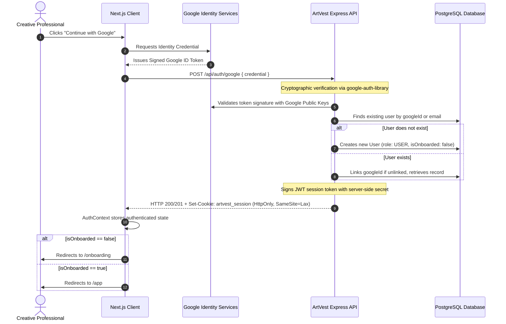
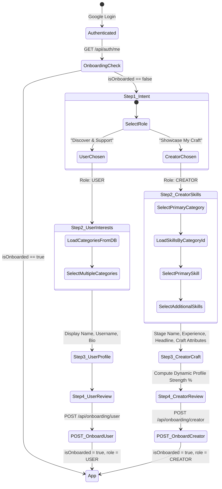

# ArtVest — System Architecture & Design Document
**PR1107 Major Project (4-Credit) • B.Tech Computer Science Engineering**

---

## 1. Executive Summary & Vision

**ArtVest** is a structured creative talent ecosystem where creative professionals (musicians, filmmakers, actors, dancers, photographers, designers, and production crew) showcase their genuine professional capabilities, discover collaborators through multi-attribute search, and build an audience.

### The Academic Problem
Existing social media platforms (Instagram, TikTok, YouTube) are designed for algorithmic passive consumption and viral trends, not professional creative discovery. Critical limitations of existing solutions include:
1. **Lack of Structured Metadata**: A filmmaker cannot search for *"Classical Singer in Jaipur available for indie film collaboration"*; search results on existing platforms are hashtag-reliant and unstructured.
2. **Homogeneous Profiles**: An actor, a sound engineer, and a choreographer all receive identical generic profile fields (bio + photo grid), ignoring role-specific requirements like vocal ranges, camera gear, acting lineages, or stage repertoires.
3. **High Gatekeeping**: Early-stage independent creators struggle to assemble multi-disciplinary crews without industry insider networks.

---

## 2. Authentication Architecture & Security

### 2.1 Google OAuth Identity Verification Flow

ArtVest uses a **zero-trust identity** model:



### 2.2 Session Cookie Configuration
- **HttpOnly**: Set to `true` to block browser JavaScript (`document.cookie`) from accessing the session token, eliminating XSS token theft vectors.
- **SameSite**: Set to `Lax` in development and `Strict` in production to prevent Cross-Site Request Forgery (CSRF).
- **Secure**: Enabled in production environments (`NODE_ENV === 'production'`) requiring HTTPS transport.
- **Path**: Set to `/` for ubiquitous domain coverage.
- **Expiration**: 7-day rolling validity.

---

## 3. Onboarding State Machine

The onboarding pipeline transitions users from raw Google identities to categorized ecosystem participants:



### Invariant Rules Enforced by System
1. **No Client Role Elevation**: A client can never supply `role: "ADMIN"` during onboarding or authentication. The server explicitly enforces either `UserRole.USER` or `UserRole.CREATOR`.
2. **Idempotent Single-Submission**: Re-attempting onboarding after completion returns HTTP 409 (`ALREADY_ONBOARDED`).
3. **Primary Skill Integrity**: Primary skills must belong to the chosen primary category.
4. **Duplicate Skill Prevention**: A creator cannot possess duplicate `CreatorSkill` records.

---

## 4. Role-Specific Craft Attributes Validation

Rather than creating dozens of relational tables for every creative craft, ArtVest uses **Category-Aware Zod Validated Attributes**:

| Craft Discipline | Validated Attributes Schema | Example Fields |
|---|---|---|
| **Music / Vocalist** | `SingerMetadataSchema` | `genres: string[]`, `languages: string[]`, `vocalType: string` |
| **Film & Acting** | `FilmActorMetadataSchema` | `languages: string[]`, `actingStyles: string[]`, `cameraSystems: string[]` |
| **Photography & Video** | `PhotographerMetadataSchema` | `photographyStyles: string[]`, `equipment: string[]`, `specializations: string[]` |
| **Dance & Motion** | `DancerMetadataSchema` | `danceForms: string[]`, `performanceType: string` |
| **Design & 3D Arts** | `DigitalArtistMetadataSchema` | `tools: string[]`, `engines: string[]`, `focus: string` |
| **Production Crew** | `ProductionCrewMetadataSchema` | `gear: string[]`, `fieldExperience: string` |

---

## 5. System Architecture Diagram

```
+-----------------------------------------------------------------------------------+
|                                 CLIENT TIER                                       |
|                                                                                   |
|  Next.js 16 App Router  |  React 19  |  Tailwind CSS  |  Framer Motion           |
|                                                                                   |
|  [ Landing Page ]    [ Login / GIS ]   [ Onboarding (5-Step) ]  [ Auth Guard ]    |
|  [ Explore Shell ]   [ Creator Studio ][ Feed Shell ]           [ App Shell ]     |
+------------------------------------------+----------------------------------------+
                                           |
                                  HTTPS / REST JSON
                             HttpOnly Cookie Credentials
                                           |
+------------------------------------------v----------------------------------------+
|                                APPLICATION TIER                                   |
|                                                                                   |
|  Node.js (v20+) & Express.js REST API with TypeScript                             |
|                                                                                   |
|  +-----------------------------------------------------------------------------+  |
|  | Middleware: Cookie-Parser, Helmet, CORS, Morgan, requireAuth, requireRole   |  |
|  +-----------------------------------------------------------------------------+  |
|  | Controllers: AuthController, OnboardingController, TaxonomyController        |  |
|  +-----------------------------------------------------------------------------+  |
|  | Services: AuthService (Google Verification), OnboardingService, Taxonomy   |  |
|  +-----------------------------------------------------------------------------+  |
|  | Validators: Zod UserOnboardingSchema, CreatorOnboardingSchema, Metadata     |  |
|  +-----------------------------------------------------------------------------+  |
|  | Scoring: calculateCreatorProfileCompletion (Deterministic 100-pt algorithm) |  |
|  +-----------------------------------------------------------------------------+  |
|  | Prisma ORM (v6): Type-safe schema client, connection pool, migrations       |  |
|  +-----------------------------------------------------------------------------+  |
+------------------------------------------+----------------------------------------+
                                           |
                              PostgreSQL Connection Pool
                                           |
+------------------------------------------v----------------------------------------+
|                                   DATA TIER                                       |
|                                                                                   |
|  PostgreSQL Relational Database                                                   |
|  - Users & Profiles: User, UserProfile, CreatorProfile                            |
|  - Taxonomy: Category, Skill, CreatorSkill                                        |
|  - Composite Unique Constraints (Prevention of duplicate accounts & skills)       |
|  - Indexing: B-Tree on emails, googleId, roles, locations, categories             |
+-----------------------------------------------------------------------------------+
```

---

## 6. Two-Phase Development Roadmap

| Phase | Milestone | Scope / Deliverables | Status |
|---|---|---|---|
| **Phase 0** | Architecture Foundation | Project structure, TypeScript, Prisma Schema, Health API, Landing shell | Completed |
| **Phase 1** | Auth & Onboarding | Google OAuth verification, HttpOnly sessions, RBAC, Onboarding UI, Taxonomy API, Tests | **COMPLETED** |
| **Phase 2** | Creator Profiles & Skills | Profile editor, role-specific metadata forms, portfolio storage | Next Phase |
| **Phase 3** | Posts & Multimedia | Upload service (Cloudinary), Audio/Video/Image showcase posts | Midterm Target |
| **Phase 4** | Feed & Social Graph | Chronological feed, Like, Comment, Save, Follow | Midterm Target |
| **Phase 5** | Explore & Discovery | Multi-criteria search (Category, Role, City, Availability) | Midterm Target |
| **Phase 6** | Studio & Notifications | Creator studio metrics, notification alerts | Midterm Target |
| **Phase 7** | Midterm Stabilization | Testing, academic viva prep, demo data seeding | **MIDTERM VIVA** |
| **Phase 8-13**| Community Projects | Project teams, virtual credit wallet, community backing | **END-TERM VIVA**|
