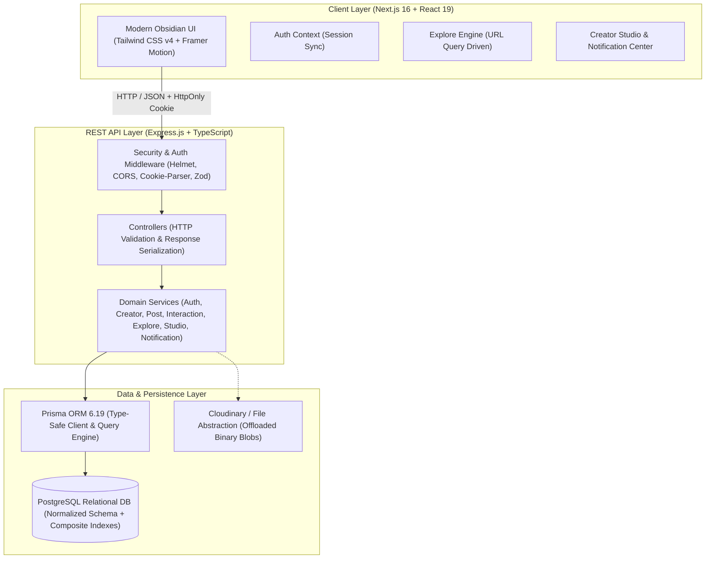
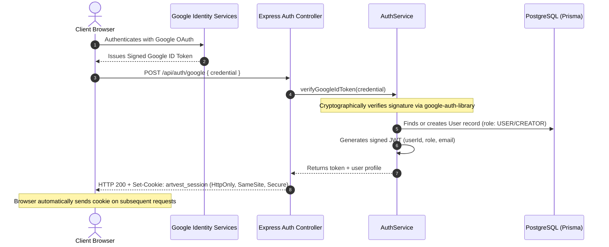
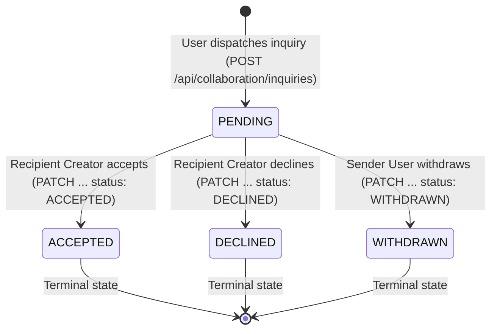

# ArtVest — Midterm Viva Defense & Architecture Guide (PR1107)
**Degree:** B.Tech Computer Science Engineering • 4-Credit Major Project  
**Milestone:** Phase 7 — Midterm Stabilization, Integration Audit & Viva Readiness  
**Current Test Baseline:** 158/158 Tests Passing (100% Pass Rate across 7 Suites)

---

## 1. Project Context & Vision

### 1.1 What problem does ArtVest solve?
ArtVest addresses the systemic breakdown of professional creative talent discovery and collaboration. Existing social media platforms (Instagram, TikTok, YouTube) optimize for algorithmic passive consumer entertainment, short-form viral trends, and ad impressions. Consequently:
- **Talent is commoditized and obscured:** Genuine creative practitioners (classical musicians, cinematographers, theatre actors, dancers, animators) are forced to play algorithm games rather than present structured credentials.
- **Discovery is unstructured:** A filmmaker seeking a *"Classical Singer in Jaipur available for indie film collaboration"* cannot query Instagram or YouTube because their profiles lack structured indexing, proficiency data, and collaboration availability.
- **Gatekeeping isolates talent:** Early-stage independent creators outside established industry hubs struggle to recruit multidisciplinary crews without insider networks.

ArtVest democratizes creative opportunity by providing a **structured, verifiable, professional creative talent ecosystem** with domain-aware taxonomies, multi-attribute discovery, portfolio showcases, and collaboration workflows.

### 1.2 Who are the platform's primary users?
1. **Creative Practitioners (CREATOR Role):** Visual artists, filmmakers, musicians, dancers, photographers, theatre artists, and designers who maintain professional profiles, showcase multimedia artifacts, monitor genuine audience engagement in Creator Studio, and receive structured collaboration inquiries.
2. **Creative Seekers & Community Members (USER Role):** Directors, producers, creative directors, event curators, and art enthusiasts who discover vetted talent across disciplines, appreciate showcases (likes, comments, bookmarks), and dispatch structured collaboration proposals.
3. **Platform Administrators (ADMIN Role):** System supervisors who govern taxonomy categories, verify creator credentials, and enforce community standards.

### 1.3 What makes ArtVest technically different from Instagram or LinkedIn?
| Dimension | Instagram / Generic Social Media | LinkedIn | ArtVest |
|---|---|---|---|
| **Data Model** | Flat bio + unstructured media grid | Corporate resume (jobs, universities) | Structured creative taxonomy (Discipline, Skill, Proficiency, Repertoire, Gear) |
| **Search Paradigm** | Free-text hashtags & follower count | Corporate title & corporate employer | Multi-attribute domain indexing (Discipline + Skill + City + Availability + Experience) |
| **Media Handling** | Compressed consumer images & reels | Generic document attachments | Discipline-specific media players (waveform audio players, aspect-ratio-aware video/image showcases) |
| **Collaboration** | Unstructured, unsolicited Direct Messages | InMail / Corporate recruiting | Formalized state machine inquiries (`PENDING` $\rightarrow$ `ACCEPTED` / `DECLINED` / `WITHDRAWN`) |
| **Discovery Ranking** | Black-box engagement algorithm (retention-focused) | Social connection proximity (1st, 2nd, 3rd degree) | Explainable, deterministic multi-token relevance scoring |

### 1.4 Why structured creative discovery instead of a simple feed?
A chronological or algorithmic feed is an *attention mechanism*, not a *team-building mechanism*. Creative projects require precise technical compatibility: a director shooting in 4K anamorphic needs a cinematographer with specific camera competencies, not merely the most popular video creator on TikTok. Structured discovery allows deterministic, multi-facet querying over normalized entities, transforming creative networking into a reliable engineering solution.

---

## 2. System Architecture & Engineering Decisions



### 2.1 Why Next.js (App Router)?
Next.js provides:
- Modern React Server Components (RSC) and Client Components separation.
- Turbopack-powered fast compilation and production optimization.
- Robust route hierarchy with layouts and nested routes (`/app/explore`, `/app/studio`, `/app/notifications`).
- Zero client-side token exposure: Next.js acts as a clean presentation consumer communicating over credentialed CORS with the Express API.

### 2.2 Why Express.js with TypeScript for the Backend?
- **Decoupled Architecture:** Separating the REST backend from the frontend prevents vendor lock-in and allows future native mobile applications (iOS/Android) or external services to reuse the identical API surface.
- **Express Layering:** Clear separation of concerns: `Routes` $\rightarrow$ `Middleware` $\rightarrow$ `Controllers` $\rightarrow$ `Services` $\rightarrow$ `Repositories/Prisma`.
- **Compile-Time Safety:** TypeScript ensures end-to-end type safety from Zod validation schemas through service inputs to Prisma data models.

### 2.3 Why PostgreSQL?
- **Relational Integrity:** Creative ecosystems are deeply relational (Users $\leftrightarrow$ Creator Profiles $\leftrightarrow$ Categories $\leftrightarrow$ Skills $\leftrightarrow$ Posts $\leftrightarrow$ Media $\leftrightarrow$ Interactions $\leftrightarrow$ Inquiries $\leftrightarrow$ Notifications).
- **ACID Transactions:** Ensuring state machine operations (e.g., inquiry acceptance, like toggling, post publishing) are executed atomically.
- **Strict Constraints:** Enforcing uniqueness, foreign key cascades, and check constraints at the engine level to prevent data corruption.
- **Indexing:** B-Tree and composite indexing (`@@index([status, categoryId])`, `@@unique([userId, postId])`) guarantee sub-millisecond lookups.

### 2.4 Why Prisma ORM?
- **Type Safety:** Auto-generated client matches the database schema exactly, eliminating runtime typos in column or table names.
- **Data Migrations:** Declarative migrations (`prisma migrate dev`) version-control database changes reproducibly across environments.
- **Engine-Level Query Generation:** Optimized SQL queries prevent boilerplate and maintain parameterized safety against SQL injection.

### 2.5 Why Layered Architecture instead of all-in-one handlers?
- **Separation of Concerns:** Controllers handle HTTP status codes and headers; Services contain business logic, authorization rules, and transactions; Prisma handles persistence.
- **Unit & Integration Testability:** Service business logic can be tested independently or exercised through Supertest HTTP assertions without tight coupling to framework internals.
- **Maintainability:** Refactoring database queries in `StudioService` requires zero changes to `studio.controller.ts` or the frontend API contracts.

---

## 3. Authentication, Sessions & Security (RBAC / IDOR)



### 3.1 How does Google authentication work?
1. Client initiates Google Identity Services prompt and receives an identity credential (`id_token`).
2. Client posts this credential to `POST /api/auth/google`.
3. Server invokes `OAuth2Client.verifyIdToken()` from Google's official `google-auth-library`, validating:
   - Cryptographic signature against Google's public certificates.
   - Audience (`aud`) matches `GOOGLE_CLIENT_ID`.
   - Token issuer (`iss`) is `accounts.google.com`.
   - Expiration timestamp (`exp`).
4. Server extracts verified email, Google user ID (`sub`), and display name.
5. In development mode, a safe mock guard is supported (`mock_test_credential:*`), but this is **strictly forbidden and blocked in production** via `config.env === 'production'` checks.

### 3.2 Why HttpOnly cookies instead of localStorage?
Storing authentication tokens in `localStorage` or `sessionStorage` exposes the user session to Cross-Site Scripting (XSS) attacks; any injected malicious script can read `window.localStorage.getItem('token')` and exfiltrate the session.
ArtVest uses:
- `HttpOnly: true`: JavaScript running in the browser cannot read or access the session cookie.
- `SameSite: Lax` (or `Strict` in production): Protects against Cross-Site Request Forgery (CSRF).
- `Secure: true` in production: Enforces transmission strictly over HTTPS.

### 3.3 How is Role-Based Access Control (RBAC) enforced?
The backend provides the `requireRole(...allowedRoles)` middleware:
```typescript
export function requireRole(...allowedRoles: UserRole[]) {
  return (req: Request, res: Response, next: NextFunction) => {
    if (!req.user || !allowedRoles.includes(req.user.role)) {
      throw new AppError('Access forbidden: Insufficient role permissions', 403, 'FORBIDDEN');
    }
    next();
  };
}
```
Endpoints like `/api/studio/*` and `/api/creator/*` require `UserRole.CREATOR`. If a standard `USER` role attempts to access them, they receive `403 FORBIDDEN`.

### 3.4 What prevents Insecure Direct Object References (IDOR)?
IDOR occurs when an application exposes a reference to an internal object (e.g., `?userId=123` or `body.creatorId=456`) and fails to verify that the authenticated caller owns that object.
ArtVest prevents IDOR through **Strict Identity Derivation**:
1. **Studio & Profile Operations:** The user ID is **never taken from user input**; it is extracted strictly from `req.user.id` (decoded from the verified `HttpOnly` JWT cookie). Any attacker-supplied `?userId=victim` or `body.userId = victim` is completely ignored by the service.
2. **Post Modification & Deletion:** `post.authorId === req.user.id` is checked before updating or deleting (`403 FORBIDDEN_POST_MUTATION`).
3. **Comment Modification:** `comment.authorId === req.user.id` is checked before editing (`403 FORBIDDEN_COMMENT_MUTATION`).
4. **Notification Read Operations:** `notification.recipientId === req.user.id` is checked before mutating `isRead` (`403 FORBIDDEN_NOTIFICATION_ACCESS`).
5. **Collaboration State Transitions:** Only the designated `recipientId` can accept or decline; only the `senderId` can withdraw (`403 FORBIDDEN_INQUIRY_ACTION`).

---

## 4. Database Design & Integrity

### 4.1 Why a relational schema instead of NoSQL?
Creative collaboration requires rigid relational integrity:
- If a post is deleted, its media records, likes, comments, and saves must cascade or update cleanly without leaving dangling orphans.
- Unique constraints (e.g., preventing duplicate likes or self-follows) can be enforced at the relational engine level.
- Multi-facet search across creators, categories, and skills requires relational JOINs and composite indexes that NoSQL document stores cannot guarantee without massive denormalization and synchronization bugs.

### 4.2 How are duplicates prevented under high concurrency?
Application-level checks like `if (await db.find()) return error` suffer from Time-of-Check to Time-of-Use (TOCTOU) race conditions when concurrent requests hit the server. ArtVest enforces database-level composite unique constraints:
- `Like`: `@@unique([postId, userId])`
- `Save`: `@@unique([postId, userId])`
- `Follow`: `@@unique([followerId, followingId])`
- `CreatorSkill`: `@@unique([creatorProfileId, skillId])`

Any duplicate insert attempt raises a relational unique constraint violation (`P2002` in Prisma), deterministically rejected by the database engine.

### 4.3 Why composite indexes?
ArtVest uses targeted composite indexes designed for real queries:
- `Post`: `@@index([status, categoryId])` and `@@index([status, publishedAt])` accelerate the public Explore and Feed queries which always filter by `status = 'PUBLISHED'`.
- `Notification`: `@@index([recipientId, isRead])` and `@@index([recipientId, createdAt])` optimize real-time unread badge counts and chronological notification listing.
- `Comment`: `@@index([postId, parentId])` accelerates threaded comment retrieval.

---

## 5. Structured Explore & Discovery (Deterministic Ranking)

```mermaid
graph LR
    Query["Search Query ('Classical Singer in Jaipur')"] --> CandidateFilter["Prisma Candidate Filter (status=PUBLISHED, isPublic=true)"]
    CandidateFilter --> TextTokenization["Text Tokenization (Lowercased Tokens)"]
    TextTokenization --> ScoringPipeline["Deterministic Multi-Facet Scoring Engine"]
    
    subgraph ScoringEngine ["Explainable Weights (Zero ML)"]
        W1["Category Match (+100)"]
        W2["Primary Skill Match (+60)"]
        W3["Secondary Skill Match (+30)"]
        W4["Location / City Match (+50)"]
        W5["Experience Level Match (+25)"]
        W6["Availability Match (+20)"]
        W7["Profile Strength (+0.5 * score)"]
        W8["Engagement Affinity (+0.1 * total)"]
    end
    
    ScoringPipeline --> ScoringEngine
    ScoringEngine --> Sorter["Deterministic Stable Sort (Score DESC, Verified DESC, ID ASC)"]
    Sorter --> Output["Paginated Ranked Results"]
```



### 5.1 How does Explore work?
The Explore engine operates in two coordinated phases:
1. **Candidate Retrieval (Database Level):** Filters active creators where `isPublic: true` and `user.isOnboarded: true`. Filters by specific selected criteria (Category ID, Skill ID, Location regex, Experience level, Availability status).
2. **Relevance Scoring & Ranking (Service Level):** When free-text search queries are provided, the candidate creators and published showcase posts are evaluated through an explainable multi-attribute scoring function.

### 5.2 Why deterministic scoring instead of machine learning or AI recommendations?
1. **Academic Defensibility:** In an academic viva, black-box ML algorithms (collaborative filtering, deep neural nets) cannot be easily explained or debugged during a live demo.
2. **Cold-Start Resilience:** New platforms lack the millions of user interaction matrices required for collaborative filtering; ML would recommend nothing or hallucinate relevance.
3. **Meritocratic Fairness:** Independent creative talent discovery must be predictable: a classical singer in Jaipur who matches all criteria should appear at the top because of genuine qualification, not opaque algorithmic weights.
4. **Reproducibility & Testing:** Deterministic formulas can be tested with strict mathematical assertions in automated test suites (verified across 25 explore tests).

### 5.3 What is the exact Explore ranking formula?
For text searches, creators accumulate points based on exact and partial token matches:
- Category Name / Slug match: $+100$ points
- Primary Skill name match: $+60$ points
- Secondary Skill name match: $+30$ points
- Location / City match: $+50$ points
- Experience Level match: $+25$ points
- Availability match: $+20$ points
- Stage name / Headline match: $+40$ points
- Bio match: $+15$ points
- Profile Completeness factor: $+0.5 \times \text{profileCompletionScore}$ (up to $50$ points)
- Verification badge: $+10$ points
- Stable tie-breaker: `id ASC` ensures identical sorting order across pagination pages.

---

## 6. Social Graph & Creative Collaboration

### 6.1 What is the lifecycle of a Collaboration Inquiry?
Collaboration inquiries follow a strict Finite State Machine (FSM):



- Any attempt to transition an inquiry out of `ACCEPTED`, `DECLINED`, or `WITHDRAWN` throws `400 INVALID_INQUIRY_STATE`.
- Non-recipients cannot accept or decline (`403 FORBIDDEN_INQUIRY_ACTION`).
- Non-senders cannot withdraw (`403 FORBIDDEN_INQUIRY_ACTION`).

### 6.2 How do comments and replies work?
- Top-level comments have `parentId = null`.
- Replies reference a parent comment.
- If a reply targets an existing reply, ArtVest flattens the reference to the root comment (`parentComment.parentId || parentComment.id`), maintaining clean 2-level discussion hierarchies.
- Cross-post parent hijacking is blocked: if `parentComment.postId !== postId`, the request is rejected with `400 INVALID_PARENT_COMMENT`.
- Commenting on draft or unpublished showcases is rejected with `400 CANNOT_INTERACT_WITH_UNPUBLISHED_POST`.

---

## 7. In-App Notifications

### 7.1 How are notifications generated?
Notifications are triggered synchronously within `InteractionService` when domain actions succeed:
- `POST_LIKED`: On showcase like.
- `COMMENT_CREATED`: On showcase comment or reply.
- `CREATOR_FOLLOWED`: When an enthusiast follows a creator.
- `COLLABORATION_INQUIRY_CREATED`: When an inquiry is sent.
- `COLLABORATION_ACCEPTED`: When a creator accepts an inquiry.
- `COLLABORATION_DECLINED`: When a creator declines an inquiry.

### 7.2 Why NotificationService with in-app database persistence instead of WebSockets?
- **Viva Stability:** WebSockets introduce persistent socket connections, ping/pong heartbeats, reconnection cascades, and complex server scaling constraints that can fail unpredictably during a live academic presentation.
- **Persistence & Auditability:** In-app notifications stored in PostgreSQL are persistent across page refreshes, browser restarts, and device handoffs.
- **Efficient Polling / SWR:** A lightweight 30-second revalidation or focus-based revalidation query to `/api/notifications/unread-count` uses a fast indexed query (`recipientId, isRead`), providing sub-5ms response times without WebSocket overhead.

### 7.3 How are self-notifications and notification spam prevented?
1. **Self-Notification Suppression:** In `NotificationService.createNotification`, if `actorId === recipientId`, execution halts immediately. An author who likes their own showcase or comments on their own work receives zero notifications.
2. **Debounce Deduplication:** If an identical action (`actorId`, `recipientId`, `type`, `resourceId`) occurred within the last 60 seconds, the existing notification is returned rather than generating redundant database rows.

---

## 8. Creator Studio & Real-World Analytics

### 8.1 How are analytics calculated? Are any counters fake or hardcoded?
**Zero counters are fake or fabricated.** Every metric in the Creator Studio is aggregated in real-time from actual relational records in PostgreSQL using parallel queries:
- $\text{Total Posts} = \text{prisma.post.count}(\{\text{authorId}\})$
- $\text{Published Posts} = \text{prisma.post.count}(\{\text{authorId, status: PUBLISHED}\})$
- $\text{Total Likes} = \text{prisma.like.count}(\{\text{post: }\{\text{authorId}\}\})$
- $\text{Total Comments} = \text{prisma.comment.count}(\{\text{post: }\{\text{authorId}\}\})$
- $\text{Total Bookmarks} = \text{prisma.save.count}(\{\text{post: }\{\text{authorId}\}\})$
- $\text{Total Followers} = \text{prisma.follow.count}(\{\text{followingId}\})$

### 8.2 What is the Total Engagement formula?
$$\text{Total Engagement} = \text{Total Likes} + \text{Total Comments} + \text{Total Saves}$$

### 8.3 What is the Collaboration Acceptance Rate formula?
$$\text{Acceptance Rate} = \frac{\text{Accepted Inquiries}}{\text{Accepted Inquiries} + \text{Declined Inquiries}} \times 100$$
If $\text{Accepted} + \text{Declined} == 0$, the formula safely yields `0%` rather than `NaN`.

---

## 9. Media & File Handling

### 9.1 Where are media files stored and why not in PostgreSQL?
Storing binary files (images, audio waveforms, MP4 video) directly in PostgreSQL via `BYTEA` columns creates massive table bloat, slows sequential scans, exhausts database RAM cache buffers, and complicates backups.
Instead:
- **Relational Metadata in PostgreSQL:** The `PostMedia` table stores rich technical metadata: `url`, `thumbnailUrl`, `mediaType`, `mimeType`, `fileSize`, `width`, `height`, `duration`, `aspectRatio`, and `orderIndex`.
- **Binary Assets Offloaded:** Binary files are uploaded to Cloudinary (or saved to the filesystem under `/uploads` in offline fallback mode).

### 9.2 How is media validated?
Uploaded files are validated against allowed MIME types:
- Images: `image/jpeg`, `image/png`, `image/webp`, `image/gif` (max 10MB)
- Audio: `audio/mpeg`, `audio/wav`, `audio/aac`, `audio/ogg` (max 50MB)
- Video: `video/mp4`, `video/webm`, `video/quicktime` (max 100MB)

---

## 10. Scope Boundaries, Limitations & Phase 8+ Roadmap

### 10.1 What is explicitly NOT implemented in Phase 0–7 and why?
To maintain architectural rigor and prevent uncontrolled scope creep:
- **No ArtCredits / Virtual Tokens:** Simulated economy systems belong to Phase 10 after multidisciplinary team structures are in place.
- **No Real Money / Payment Gateways:** ArtVest is an academic major project, not a commercial fintech platform.
- **No Direct Messaging (DMs) / Chat:** Unstructured chat recreates social media spam; Phase 4 & 6 intentionally replace chat with structured collaboration inquiries and notifications.
- **No Machine Learning Recommendation Models:** Premature ML models without real user interaction data provide low value compared to explainable, deterministic multi-attribute indexing.

### 10.2 What is the roadmap for Phase 8 and beyond?
- **Phase 8 — Creative Projects:** Multipart collaborative project workspaces, project briefs, and role requirements (e.g., an indie film project seeking a composer, editor, and colorist).
- **Phase 9 — Multidisciplinary Teams:** Formal team assembly, invitation flows, and joint showcase credits.
- **Phase 10 — ArtCredits:** Simulated virtual credit economy for milestone allocations and non-cash project collaboration.
- **Phase 11 — Community Backing:** Micro-backing and community support tiers for verified creative projects.
- **Phase 12 — Platform Analytics & Discovery Heuristics.**
- **Phase 13 — Final Viva Defense & Thesis Documentation.**
